# Database Languages - Comprehensive Mermaid Diagrams

This file contains all the Mermaid diagrams referenced in the technical study report on database languages. Each diagram includes specific placement instructions for your Word document.

---

## 📍 PLACEMENT GUIDE FOR WORD DOCUMENT

### **Section References from Expanded Assignment:**

- **Section 2.1** → Evolution of Database Languages
- **Section 2.3** → Core Database Languages Overview
- **Section 2.4** → Three-Schema Architecture Foundation
- **Section A.1** → Storage Definition Language (SDL)
- **Section B** → Architectural Integration
- **Section C** → Case Studies (E-commerce, Banking, Healthcare)
- **Section D** → Challenges and Opportunities

---

## 1. Three-Schema Architecture Foundation

### Diagram 1: Three-Schema Architecture Overview

**📍 WORD PLACEMENT:** Section 2.4 "Three-Schema Architecture Foundation" - Insert after paragraph discussing "Architecture Components"

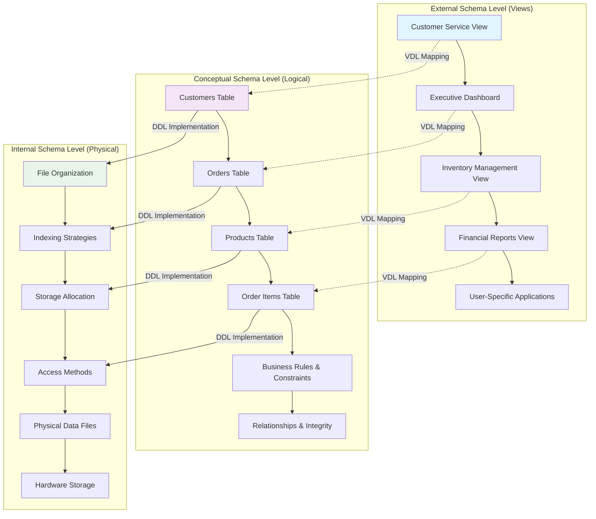
```mermaid
graph TD
    subgraph "External Schema Level (Views)"
        A[Customer Service View] --> B[Executive Dashboard]
        B --> C[Inventory Management View]
        C --> D[Financial Reports View]
        D --> E[User-Specific Applications]
    end

    subgraph "Conceptual Schema Level (Logical)"
        F[Customers Table] --> G[Orders Table]
        G --> H[Products Table]
        H --> I[Order Items Table]
        I --> J[Business Rules & Constraints]
        J --> K[Relationships & Integrity]
    end

    subgraph "Internal Schema Level (Physical)"
        L[File Organization] --> M[Indexing Strategies]
        M --> N[Storage Allocation]
        N --> O[Access Methods]
        O --> P[Physical Data Files]
        P --> Q[Hardware Storage]
    end

    A -.->|VDL Mapping| F
    B -.->|VDL Mapping| G
    C -.->|VDL Mapping| H
    D -.->|VDL Mapping| I

    F -->|DDL Implementation| L
    G -->|DDL Implementation| M
    H -->|DDL Implementation| N
    I -->|DDL Implementation| O

    style A fill:#e1f5fe
    style F fill:#f3e5f5
    style L fill:#e8f5e8
```

### Diagram 2: Data Independence Relationships

**📍 WORD PLACEMENT:** Section 2.4 "Three-Schema Architecture Foundation" - Insert after paragraph discussing "Data Independence Benefits"

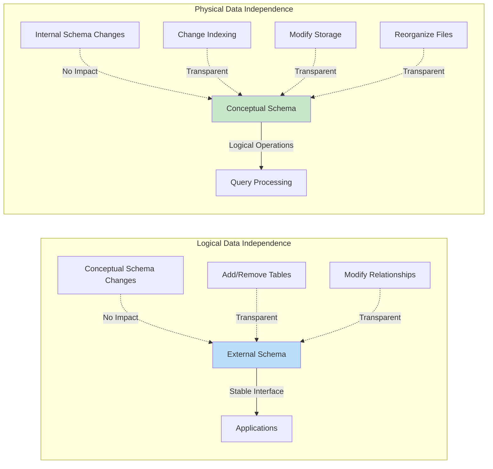
```mermaid
graph LR
    subgraph "Logical Data Independence"
        A[External Schema] -->|Stable Interface| B[Applications]
        C[Conceptual Schema Changes] -.->|No Impact| A
        D[Add/Remove Tables] -.->|Transparent| A
        E[Modify Relationships] -.->|Transparent| A
    end

    subgraph "Physical Data Independence"
        F[Conceptual Schema] -->|Logical Operations| G[Query Processing]
        H[Internal Schema Changes] -.->|No Impact| F
        I[Change Indexing] -.->|Transparent| F
        J[Modify Storage] -.->|Transparent| F
        K[Reorganize Files] -.->|Transparent| F
    end

    style A fill:#bbdefb
    style F fill:#c8e6c9
```

---

## 2. Database Languages Overview

### Diagram 3: Database Language Hierarchy

**📍 WORD PLACEMENT:** Section 2.3 "Core Database Languages Overview" - Insert after paragraph discussing "Primary Language Categories"

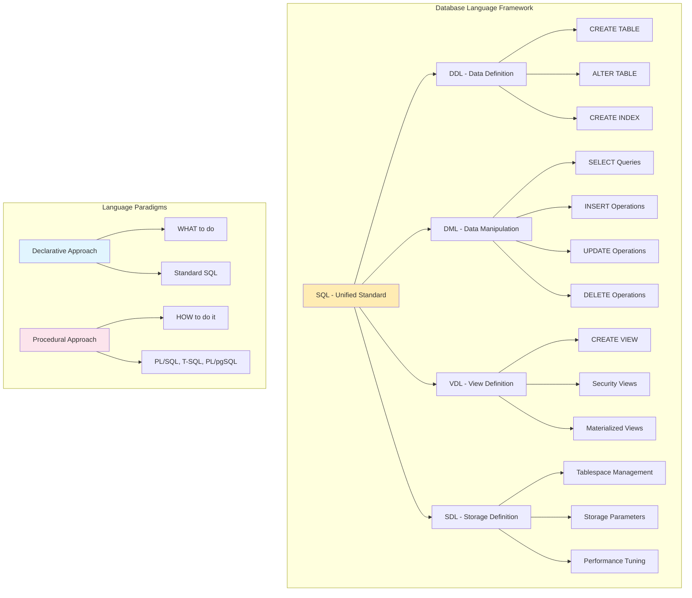
```mermaid
graph TB
    subgraph "Database Language Framework"
        A[SQL - Unified Standard] --> B[DDL - Data Definition]
        A --> C[DML - Data Manipulation]
        A --> D[VDL - View Definition]
        A --> E[SDL - Storage Definition]

        B --> F[CREATE TABLE]
        B --> G[ALTER TABLE]
        B --> H[CREATE INDEX]

        C --> I[SELECT Queries]
        C --> J[INSERT Operations]
        C --> K[UPDATE Operations]
        C --> L[DELETE Operations]

        D --> M[CREATE VIEW]
        D --> N[Security Views]
        D --> O[Materialized Views]

        E --> P[Tablespace Management]
        E --> Q[Storage Parameters]
        E --> R[Performance Tuning]
    end

    subgraph "Language Paradigms"
        S[Declarative Approach] --> T[WHAT to do]
        U[Procedural Approach] --> V[HOW to do it]

        S --> W[Standard SQL]
        U --> X[PL/SQL, T-SQL, PL/pgSQL]
    end

    style A fill:#ffecb3
    style S fill:#e1f5fe
    style U fill:#fce4ec
```

### Diagram 4: Language-to-Schema Mapping

**📍 WORD PLACEMENT:** Section 2.4 "Three-Schema Architecture Foundation" - Insert at the end of the section, before moving to Section 3

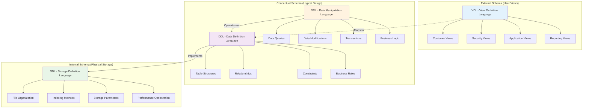
```mermaid
graph TD
    subgraph "External Schema (User Views)"
        A[VDL - View Definition Language]
        A --> A1[Customer Views]
        A --> A2[Security Views]
        A --> A3[Application Views]
        A --> A4[Reporting Views]
    end

    subgraph "Conceptual Schema (Logical Design)"
        B[DDL - Data Definition Language]
        B --> B1[Table Structures]
        B --> B2[Relationships]
        B --> B3[Constraints]
        B --> B4[Business Rules]

        C[DML - Data Manipulation Language]
        C --> C1[Data Queries]
        C --> C2[Data Modifications]
        C --> C3[Transactions]
        C --> C4[Business Logic]
    end

    subgraph "Internal Schema (Physical Storage)"
        D[SDL - Storage Definition Language]
        D --> D1[File Organization]
        D --> D2[Indexing Methods]
        D --> D3[Storage Parameters]
        D --> D4[Performance Optimization]
    end

    A -.->|Maps to| B
    B -->|Implements| D
    C -->|Operates on| B

    style A fill:#e3f2fd
    style B fill:#f3e5f5
    style C fill:#fff3e0
    style D fill:#e8f5e8
```

---

## 3. Database Language Evolution

### Diagram 5: Historical Evolution Timeline

**📍 WORD PLACEMENT:** Section 2.1 "Evolution of Database Languages" - Insert after paragraph discussing the "Historical Timeline"

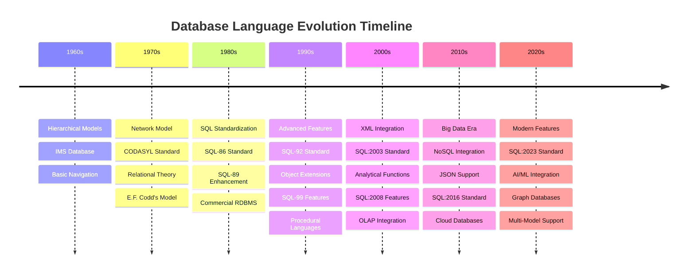
```mermaid
timeline
    title Database Language Evolution Timeline

    1960s : Hierarchical Models
          : IMS Database
          : Basic Navigation

    1970s : Network Model
          : CODASYL Standard
          : Relational Theory
          : E.F. Codd's Model

    1980s : SQL Standardization
          : SQL-86 Standard
          : SQL-89 Enhancement
          : Commercial RDBMS

    1990s : Advanced Features
          : SQL-92 Standard
          : Object Extensions
          : SQL-99 Features
          : Procedural Languages

    2000s : XML Integration
          : SQL:2003 Standard
          : Analytical Functions
          : SQL:2008 Features
          : OLAP Integration

    2010s : Big Data Era
          : NoSQL Integration
          : JSON Support
          : SQL:2016 Standard
          : Cloud Databases

    2020s : Modern Features
          : SQL:2023 Standard
          : AI/ML Integration
          : Graph Databases
          : Multi-Model Support
```

### Diagram 6: Language Integration Architecture

**📍 WORD PLACEMENT:** Section 6.2 "Problem Space: The Growing Complexity Challenge" - Insert after paragraph discussing "Technical Complexity Evolution"

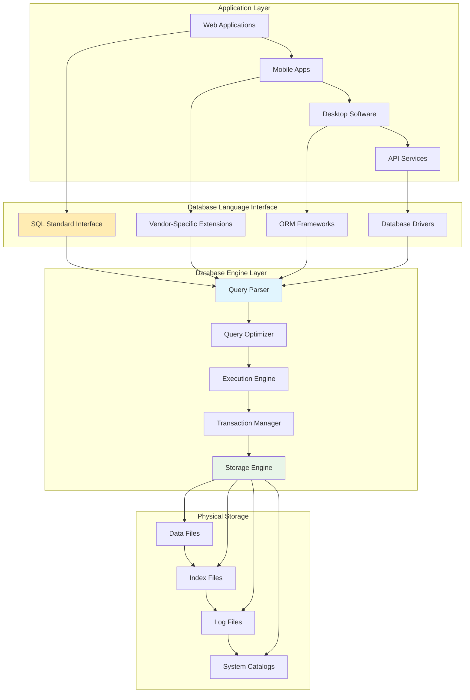
```mermaid
graph TB
    subgraph "Application Layer"
        A[Web Applications] --> B[Mobile Apps]
        B --> C[Desktop Software]
        C --> D[API Services]
    end

    subgraph "Database Language Interface"
        E[SQL Standard Interface]
        F[Vendor-Specific Extensions]
        G[ORM Frameworks]
        H[Database Drivers]
    end

    subgraph "Database Engine Layer"
        I[Query Parser] --> J[Query Optimizer]
        J --> K[Execution Engine]
        K --> L[Transaction Manager]
        L --> M[Storage Engine]
    end

    subgraph "Physical Storage"
        N[Data Files] --> O[Index Files]
        O --> P[Log Files]
        P --> Q[System Catalogs]
    end

    A --> E
    B --> F
    C --> G
    D --> H

    E --> I
    F --> I
    G --> I
    H --> I

    M --> N
    M --> O
    M --> P
    M --> Q

    style E fill:#ffecb3
    style I fill:#e1f5fe
    style M fill:#e8f5e8
```

---

## 4. Performance and Optimization Diagrams

### Diagram 7: Query Processing Flow

**📍 WORD PLACEMENT:** Section A.1 "Storage Definition Language (SDL)" - Insert after paragraph discussing "Performance Impact" OR in Section D.1 "Performance Optimization Complexity"

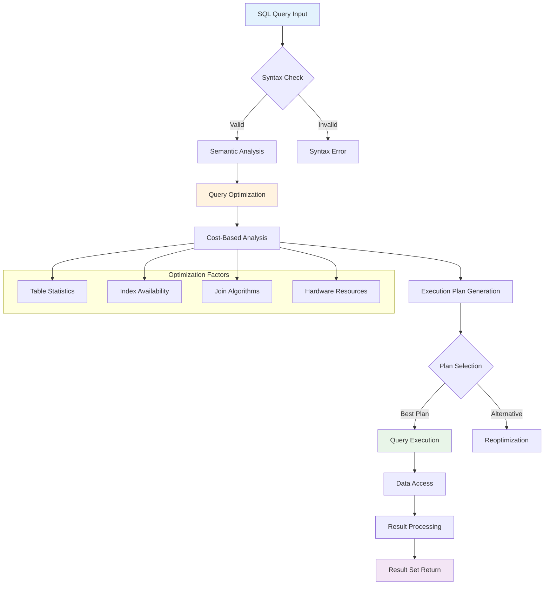
```mermaid
flowchart TD
    A[SQL Query Input] --> B{Syntax Check}
    B -->|Valid| C[Semantic Analysis]
    B -->|Invalid| D[Syntax Error]

    C --> E[Query Optimization]
    E --> F[Cost-Based Analysis]
    F --> G[Execution Plan Generation]

    G --> H{Plan Selection}
    H -->|Best Plan| I[Query Execution]
    H -->|Alternative| J[Reoptimization]

    I --> K[Data Access]
    K --> L[Result Processing]
    L --> M[Result Set Return]

    subgraph "Optimization Factors"
        N[Table Statistics]
        O[Index Availability]
        P[Join Algorithms]
        Q[Hardware Resources]
    end

    F --> N
    F --> O
    F --> P
    F --> Q

    style A fill:#e3f2fd
    style E fill:#fff3e0
    style I fill:#e8f5e8
    style M fill:#f3e5f5
```

### Diagram 8: Database Language Performance Comparison

**📍 WORD PLACEMENT:** Section A.6 "Declarative vs Procedural Language Paradigms" - Insert after comparing declarative and procedural approaches

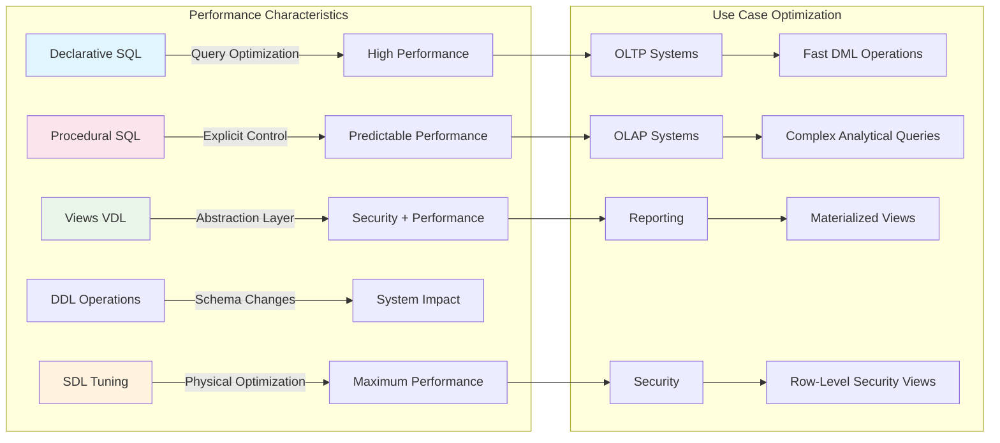
```mermaid
graph LR
    subgraph "Performance Characteristics"
        A[Declarative SQL] -->|Query Optimization| B[High Performance]
        C[Procedural SQL] -->|Explicit Control| D[Predictable Performance]
        E[Views VDL] -->|Abstraction Layer| F[Security + Performance]
        G[DDL Operations] -->|Schema Changes| H[System Impact]
        I[SDL Tuning] -->|Physical Optimization| J[Maximum Performance]
    end

    subgraph "Use Case Optimization"
        K[OLTP Systems] --> L[Fast DML Operations]
        M[OLAP Systems] --> N[Complex Analytical Queries]
        O[Reporting] --> P[Materialized Views]
        Q[Security] --> R[Row-Level Security Views]
    end

    B --> K
    D --> M
    F --> O
    J --> Q

    style A fill:#e1f5fe
    style C fill:#fce4ec
    style E fill:#e8f5e8
    style I fill:#fff3e0
```

---

## 5. Security and Compliance Architecture

### Diagram 9: Multi-Layer Security Implementation

**📍 WORD PLACEMENT:** Section A.4 "View Definition Language (VDL)" - Insert after discussing "Security and Access Control Views" OR Section D.1 "Security and Compliance Challenges"

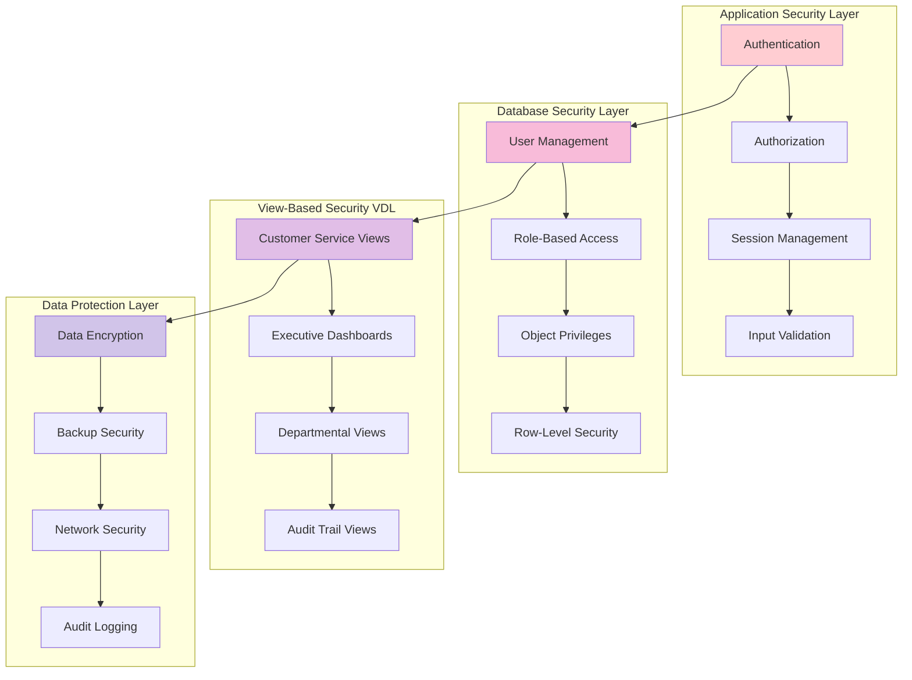
```mermaid
graph TB
    subgraph "Application Security Layer"
        A[Authentication] --> B[Authorization]
        B --> C[Session Management]
        C --> D[Input Validation]
    end

    subgraph "Database Security Layer"
        E[User Management] --> F[Role-Based Access]
        F --> G[Object Privileges]
        G --> H[Row-Level Security]
    end

    subgraph "View-Based Security VDL"
        I[Customer Service Views] --> J[Executive Dashboards]
        J --> K[Departmental Views]
        K --> L[Audit Trail Views]
    end

    subgraph "Data Protection Layer"
        M[Data Encryption] --> N[Backup Security]
        N --> O[Network Security]
        O --> P[Audit Logging]
    end

    A --> E
    E --> I
    I --> M

    style A fill:#ffcdd2
    style E fill:#f8bbd9
    style I fill:#e1bee7
    style M fill:#d1c4e9
```

### Diagram 10: Compliance Framework Integration

**📍 WORD PLACEMENT:** Section C.2 "Financial Services Banking System Case Study" - Insert after discussing regulatory compliance (Basel III, GDPR, PCI-DSS) OR in Section D "Challenges and Opportunities"

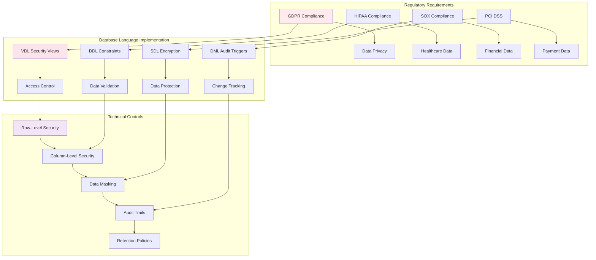
```mermaid
graph TD
    subgraph "Regulatory Requirements"
        A[GDPR Compliance] --> B[Data Privacy]
        C[HIPAA Compliance] --> D[Healthcare Data]
        E[SOX Compliance] --> F[Financial Data]
        G[PCI DSS] --> H[Payment Data]
    end

    subgraph "Database Language Implementation"
        I[VDL Security Views] --> J[Access Control]
        K[DDL Constraints] --> L[Data Validation]
        M[DML Audit Triggers] --> N[Change Tracking]
        O[SDL Encryption] --> P[Data Protection]
    end

    subgraph "Technical Controls"
        Q[Row-Level Security] --> R[Column-Level Security]
        R --> S[Data Masking]
        S --> T[Audit Trails]
        T --> U[Retention Policies]
    end

    A --> I
    C --> K
    E --> M
    G --> O

    J --> Q
    L --> R
    N --> T
    P --> S

    style A fill:#ffebee
    style I fill:#fce4ec
    style Q fill:#f3e5f5
```

---

## 6. Enterprise Integration Patterns

### Diagram 11: Modern Database Integration Architecture

**📍 WORD PLACEMENT:** Section 6.3 "Challenges: Multi-Dimensional Complexity" - Insert after discussing "Organizational Challenges" OR in Section B "Architectural Integration"

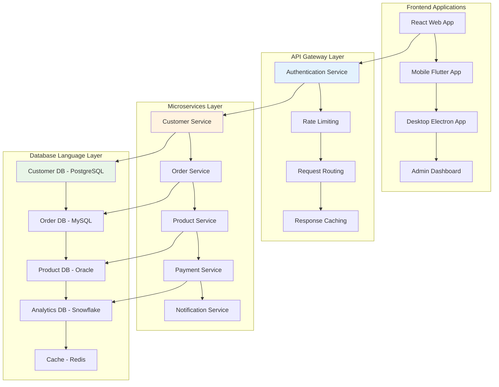
```mermaid
graph TB
    subgraph "Frontend Applications"
        A[React Web App] --> B[Mobile Flutter App]
        B --> C[Desktop Electron App]
        C --> D[Admin Dashboard]
    end

    subgraph "API Gateway Layer"
        E[Authentication Service] --> F[Rate Limiting]
        F --> G[Request Routing]
        G --> H[Response Caching]
    end

    subgraph "Microservices Layer"
        I[Customer Service] --> J[Order Service]
        J --> K[Product Service]
        K --> L[Payment Service]
        L --> M[Notification Service]
    end

    subgraph "Database Language Layer"
        N[Customer DB - PostgreSQL] --> O[Order DB - MySQL]
        O --> P[Product DB - Oracle]
        P --> Q[Analytics DB - Snowflake]
        Q --> R[Cache - Redis]
    end

    A --> E
    E --> I
    I --> N
    J --> O
    K --> P
    L --> Q

    style E fill:#e3f2fd
    style I fill:#fff3e0
    style N fill:#e8f5e8
```

### Diagram 12: Cloud-Native Database Architecture

**📍 WORD PLACEMENT:** Section D "Challenges and Opportunities in Database Language Implementation" - Insert when discussing modern cloud integration challenges

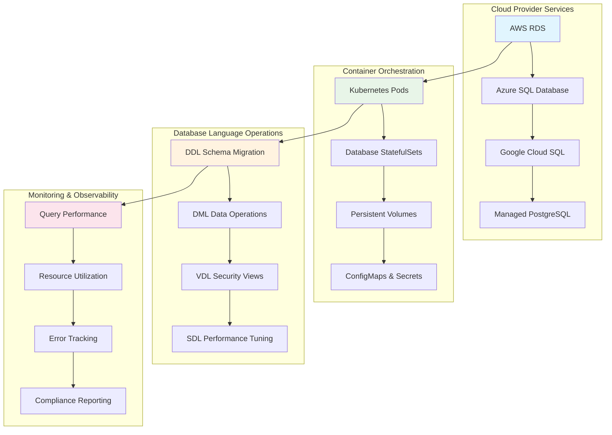
```mermaid
graph TD
    subgraph "Cloud Provider Services"
        A[AWS RDS] --> B[Azure SQL Database]
        B --> C[Google Cloud SQL]
        C --> D[Managed PostgreSQL]
    end

    subgraph "Container Orchestration"
        E[Kubernetes Pods] --> F[Database StatefulSets]
        F --> G[Persistent Volumes]
        G --> H[ConfigMaps & Secrets]
    end

    subgraph "Database Language Operations"
        I[DDL Schema Migration] --> J[DML Data Operations]
        J --> K[VDL Security Views]
        K --> L[SDL Performance Tuning]
    end

    subgraph "Monitoring & Observability"
        M[Query Performance] --> N[Resource Utilization]
        N --> O[Error Tracking]
        O --> P[Compliance Reporting]
    end

    A --> E
    E --> I
    I --> M

    style A fill:#e1f5fe
    style E fill:#e8f5e8
    style I fill:#fff3e0
    style M fill:#fce4ec
```

---

## 7. Case Study Architecture Diagrams

### Diagram 13: E-commerce Platform Database Architecture

**📍 WORD PLACEMENT:** Section C.1 "E-commerce Platform Case Study" - Insert at the beginning of the case study to show the complete database schema

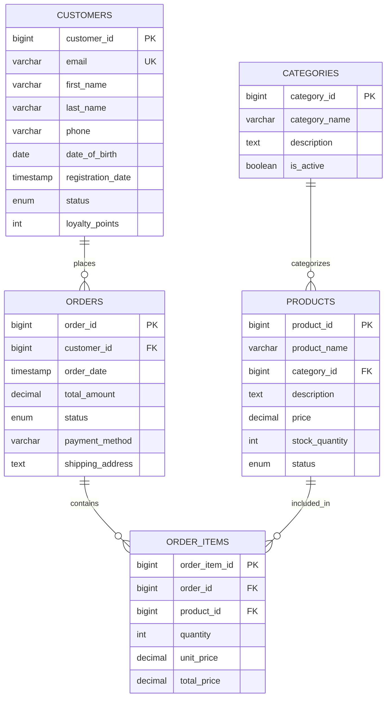
```mermaid
erDiagram
    CUSTOMERS {
        bigint customer_id PK
        varchar email UK
        varchar first_name
        varchar last_name
        varchar phone
        date date_of_birth
        timestamp registration_date
        enum status
        int loyalty_points
    }

    ORDERS {
        bigint order_id PK
        bigint customer_id FK
        timestamp order_date
        decimal total_amount
        enum status
        varchar payment_method
        text shipping_address
    }

    PRODUCTS {
        bigint product_id PK
        varchar product_name
        bigint category_id FK
        text description
        decimal price
        int stock_quantity
        enum status
    }

    ORDER_ITEMS {
        bigint order_item_id PK
        bigint order_id FK
        bigint product_id FK
        int quantity
        decimal unit_price
        decimal total_price
    }

    CATEGORIES {
        bigint category_id PK
        varchar category_name
        text description
        boolean is_active
    }

    CUSTOMERS ||--o{ ORDERS : "places"
    ORDERS ||--o{ ORDER_ITEMS : "contains"
    PRODUCTS ||--o{ ORDER_ITEMS : "included_in"
    CATEGORIES ||--o{ PRODUCTS : "categorizes"
```

### Diagram 14: Banking System Security Architecture

**📍 WORD PLACEMENT:** Section C.2 "Financial Services Banking System Case Study" - Insert at the beginning of the banking case study to show the multi-layered security approach

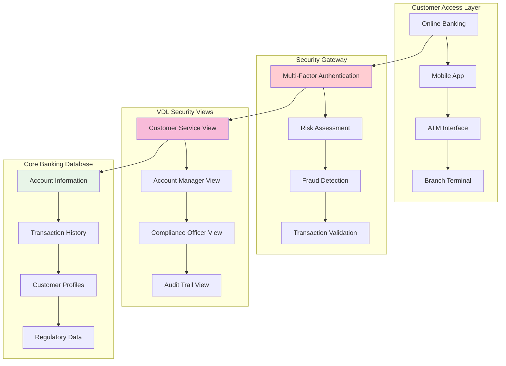
```mermaid
graph TB
    subgraph "Customer Access Layer"
        A[Online Banking] --> B[Mobile App]
        B --> C[ATM Interface]
        C --> D[Branch Terminal]
    end

    subgraph "Security Gateway"
        E[Multi-Factor Authentication] --> F[Risk Assessment]
        F --> G[Fraud Detection]
        G --> H[Transaction Validation]
    end

    subgraph "VDL Security Views"
        I[Customer Service View] --> J[Account Manager View]
        J --> K[Compliance Officer View]
        K --> L[Audit Trail View]
    end

    subgraph "Core Banking Database"
        M[Account Information] --> N[Transaction History]
        N --> O[Customer Profiles]
        O --> P[Regulatory Data]
    end

    A --> E
    E --> I
    I --> M

    style E fill:#ffcdd2
    style I fill:#f8bbd9
    style M fill:#e8f5e8
```

---

## 8. Future Technology Integration

### Diagram 15: AI/ML Enhanced Database Operations

**📍 WORD PLACEMENT:** Section D.2 "Future Opportunities" - Insert when discussing AI/ML integration with database languages and emerging technologies

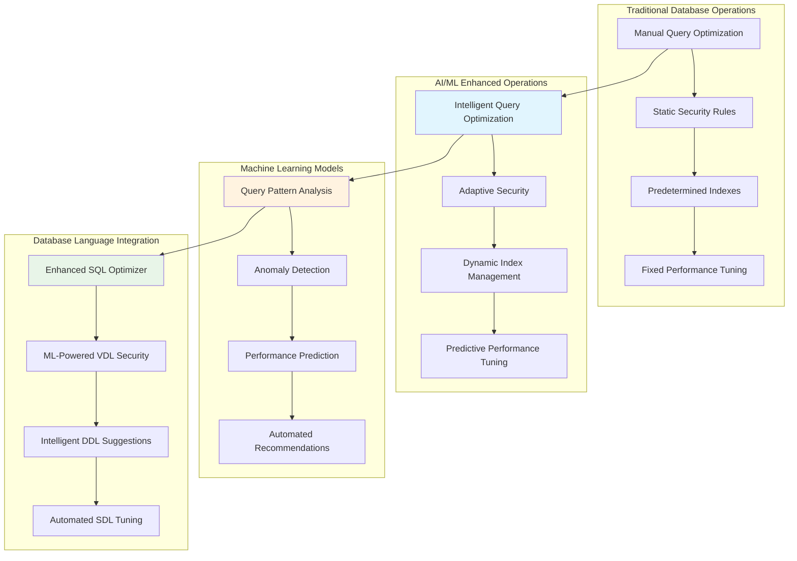
```mermaid
graph TB
    subgraph "Traditional Database Operations"
        A[Manual Query Optimization] --> B[Static Security Rules]
        B --> C[Predetermined Indexes]
        C --> D[Fixed Performance Tuning]
    end

    subgraph "AI/ML Enhanced Operations"
        E[Intelligent Query Optimization] --> F[Adaptive Security]
        F --> G[Dynamic Index Management]
        G --> H[Predictive Performance Tuning]
    end

    subgraph "Machine Learning Models"
        I[Query Pattern Analysis] --> J[Anomaly Detection]
        J --> K[Performance Prediction]
        K --> L[Automated Recommendations]
    end

    subgraph "Database Language Integration"
        M[Enhanced SQL Optimizer] --> N[ML-Powered VDL Security]
        N --> O[Intelligent DDL Suggestions]
        O --> P[Automated SDL Tuning]
    end

    A --> E
    E --> I
    I --> M

    style E fill:#e1f5fe
    style I fill:#fff3e0
    style M fill:#e8f5e8
```

### Diagram 16: Next-Generation Database Architecture

**📍 WORD PLACEMENT:** Section D.2 "Future Opportunities" - Insert at the end of the section when discussing multi-model databases and future trends

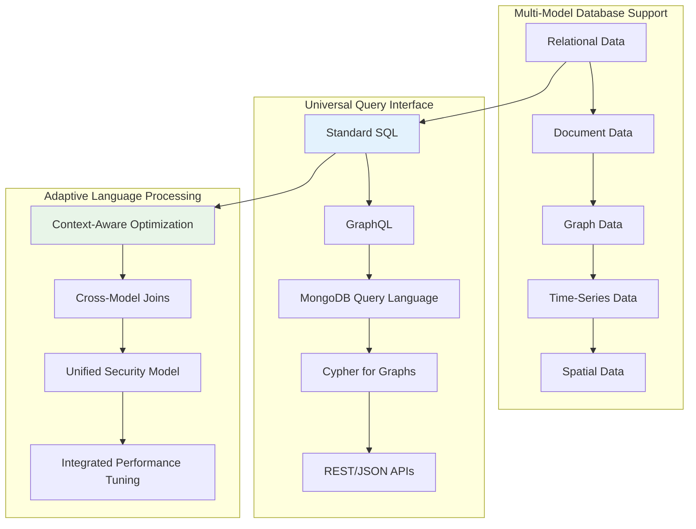
```mermaid
graph TD
    subgraph "Multi-Model Database Support"
        A[Relational Data] --> B[Document Data]
        B --> C[Graph Data]
        C --> D[Time-Series Data]
        D --> E[Spatial Data]
    end

    subgraph "Universal Query Interface"
        F[Standard SQL] --> G[GraphQL]
        G --> H[MongoDB Query Language]
        H --> I[Cypher for Graphs]
        I --> J[REST/JSON APIs]
    end

    subgraph "Adaptive Language Processing"
        K[Context-Aware Optimization] --> L[Cross-Model Joins]
        L --> M[Unified Security Model]
        M --> N[Integrated Performance Tuning]
    end

    A --> F
    F --> K

    style F fill:#e3f2fd
    style K fill:#e8f5e8
```

---

## 📋 QUICK REFERENCE TABLE - EXACT PLACEMENT GUIDE

| Diagram # | Diagram Name                              | Word Document Section | Specific Placement Location                              |
| --------- | ----------------------------------------- | --------------------- | -------------------------------------------------------- |
| 1         | Three-Schema Architecture Overview        | Section 2.4           | After "Architecture Components" paragraph                |
| 2         | Data Independence Relationships           | Section 2.4           | After "Data Independence Benefits" paragraph             |
| 3         | Database Language Hierarchy               | Section 2.3           | After "Primary Language Categories" paragraph            |
| 4         | Language-to-Schema Mapping                | Section 2.4           | At end of section, before Section 3                      |
| 5         | Historical Evolution Timeline             | Section 2.1           | After "Historical Timeline" paragraph                    |
| 6         | Language Integration Architecture         | Section 6.2           | After "Technical Complexity Evolution" paragraph         |
| 7         | Query Processing Flow                     | Section A.1 or D.1    | After "Performance Impact" OR "Performance Optimization" |
| 8         | Database Language Performance Comparison  | Section A.6           | After comparing declarative vs procedural approaches     |
| 9         | Multi-Layer Security Implementation       | Section A.4 or D.1    | After "Security and Access Control Views"                |
| 10        | Compliance Framework Integration          | Section C.2 or D      | After discussing regulatory compliance                   |
| 11        | Modern Database Integration Architecture  | Section 6.3 or B      | After "Organizational Challenges" paragraph              |
| 12        | Cloud-Native Database Architecture        | Section D             | When discussing cloud integration challenges             |
| 13        | E-commerce Platform Database Architecture | Section C.1           | At beginning of e-commerce case study                    |
| 14        | Banking System Security Architecture      | Section C.2           | At beginning of banking case study                       |
| 15        | AI/ML Enhanced Database Operations        | Section D.2           | When discussing AI/ML integration                        |
| 16        | Next-Generation Database Architecture     | Section D.2           | At end when discussing future trends                     |
| 17        | Performance Optimization Guidelines       | Section 9.2           | At beginning of performance optimization section         |
| 18        | Multi-Layer Security Implementation       | Section 9.3           | At beginning of security best practices section          |
| 19        | Performance Optimization Decision Tree    | Section 9.2           | After the performance checklist                          |
| 20        | Database Security Audit Framework         | Section 9.3           | After discussing audit level controls                    |

---

## 9. Implementation Guidelines Diagrams

### Diagram 17: Performance Optimization Guidelines (Section 9.2)

**📍 WORD PLACEMENT:** Section 9.2 "Performance Optimization Guidelines" - Insert at the beginning of the section to show the complete optimization workflow

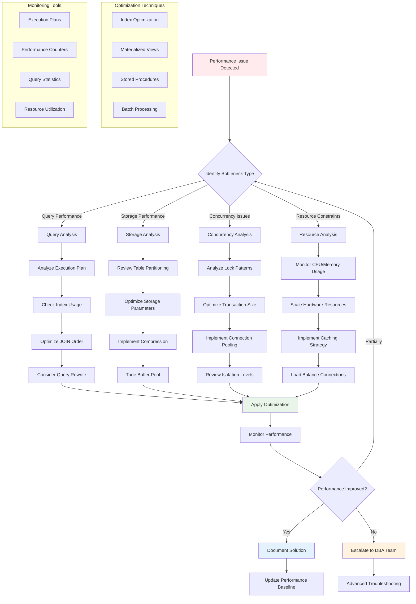
```mermaid
flowchart TD
    A[Performance Issue Detected] --> B{Identify Bottleneck Type}

    B -->|Query Performance| C[Query Analysis]
    B -->|Storage Performance| D[Storage Analysis]
    B -->|Concurrency Issues| E[Concurrency Analysis]
    B -->|Resource Constraints| F[Resource Analysis]

    C --> C1[Analyze Execution Plan]
    C1 --> C2[Check Index Usage]
    C2 --> C3[Optimize JOIN Order]
    C3 --> C4[Consider Query Rewrite]

    D --> D1[Review Table Partitioning]
    D1 --> D2[Optimize Storage Parameters]
    D2 --> D3[Implement Compression]
    D3 --> D4[Tune Buffer Pool]

    E --> E1[Analyze Lock Patterns]
    E1 --> E2[Optimize Transaction Size]
    E2 --> E3[Implement Connection Pooling]
    E3 --> E4[Review Isolation Levels]

    F --> F1[Monitor CPU/Memory Usage]
    F1 --> F2[Scale Hardware Resources]
    F2 --> F3[Implement Caching Strategy]
    F3 --> F4[Load Balance Connections]

    C4 --> G[Apply Optimization]
    D4 --> G
    E4 --> G
    F4 --> G

    G --> H[Monitor Performance]
    H --> I{Performance Improved?}
    I -->|Yes| J[Document Solution]
    I -->|No| K[Escalate to DBA Team]
    I -->|Partially| B

    J --> L[Update Performance Baseline]
    K --> M[Advanced Troubleshooting]

    subgraph "Optimization Techniques"
        N[Index Optimization]
        O[Materialized Views]
        P[Stored Procedures]
        Q[Batch Processing]
    end

    subgraph "Monitoring Tools"
        R[Execution Plans]
        S[Performance Counters]
        T[Query Statistics]
        U[Resource Utilization]
    end

    style A fill:#ffebee
    style G fill:#e8f5e8
    style J fill:#e3f2fd
    style K fill:#fff3e0
```

### Diagram 18: Multi-Layer Security Implementation (Section 9.3)

**📍 WORD PLACEMENT:** Section 9.3 "Security Implementation Best Practices" - Insert at the beginning of the section to illustrate the comprehensive security architecture

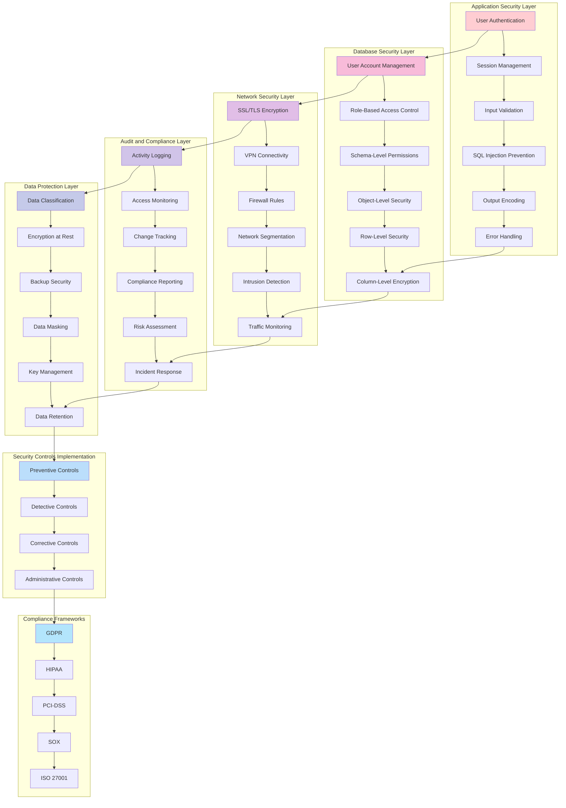
```mermaid
graph TB
    subgraph "Application Security Layer"
        A1[User Authentication] --> A2[Session Management]
        A2 --> A3[Input Validation]
        A3 --> A4[SQL Injection Prevention]
        A4 --> A5[Output Encoding]
        A5 --> A6[Error Handling]
    end

    subgraph "Database Security Layer"
        B1[User Account Management] --> B2[Role-Based Access Control]
        B2 --> B3[Schema-Level Permissions]
        B3 --> B4[Object-Level Security]
        B4 --> B5[Row-Level Security]
        B5 --> B6[Column-Level Encryption]
    end

    subgraph "Network Security Layer"
        C1[SSL/TLS Encryption] --> C2[VPN Connectivity]
        C2 --> C3[Firewall Rules]
        C3 --> C4[Network Segmentation]
        C4 --> C5[Intrusion Detection]
        C5 --> C6[Traffic Monitoring]
    end

    subgraph "Audit and Compliance Layer"
        D1[Activity Logging] --> D2[Access Monitoring]
        D2 --> D3[Change Tracking]
        D3 --> D4[Compliance Reporting]
        D4 --> D5[Risk Assessment]
        D5 --> D6[Incident Response]
    end

    subgraph "Data Protection Layer"
        E1[Data Classification] --> E2[Encryption at Rest]
        E2 --> E3[Backup Security]
        E3 --> E4[Data Masking]
        E4 --> E5[Key Management]
        E5 --> E6[Data Retention]
    end

    A1 --> B1
    B1 --> C1
    C1 --> D1
    D1 --> E1

    A6 --> B6
    B6 --> C6
    C6 --> D6
    D6 --> E6

    subgraph "Security Controls Implementation"
        F1[Preventive Controls] --> F2[Detective Controls]
        F2 --> F3[Corrective Controls]
        F3 --> F4[Administrative Controls]
    end

    subgraph "Compliance Frameworks"
        G1[GDPR] --> G2[HIPAA]
        G2 --> G3[PCI-DSS]
        G3 --> G4[SOX]
        G4 --> G5[ISO 27001]
    end

    E6 --> F1
    F4 --> G1

    style A1 fill:#ffcdd2
    style B1 fill:#f8bbd9
    style C1 fill:#e1bee7
    style D1 fill:#d1c4e9
    style E1 fill:#c5cae9
    style F1 fill:#bbdefb
    style G1 fill:#b3e5fc
```

### Diagram 19: Performance Optimization Decision Tree

**📍 WORD PLACEMENT:** Section 9.2 "Performance Optimization Guidelines" - Insert after the checklist to show decision-making process

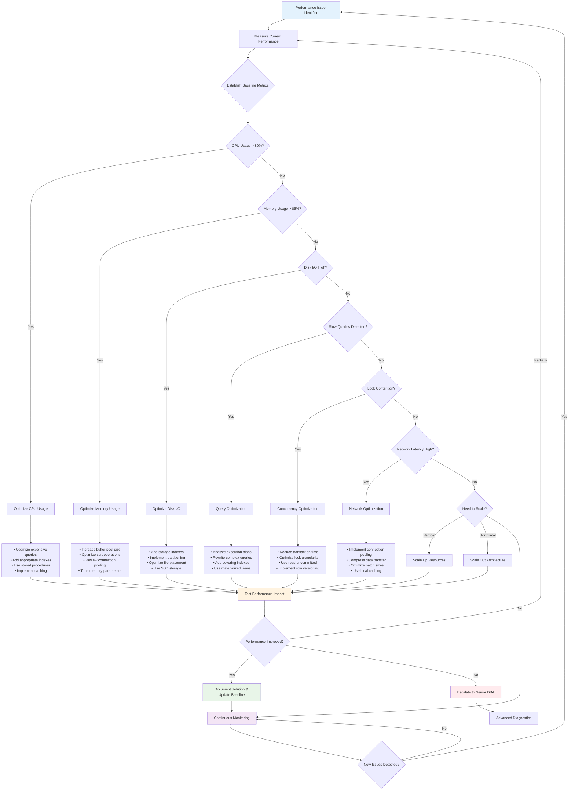
```mermaid
graph TD
    START[Performance Issue Identified] --> MEASURE[Measure Current Performance]
    MEASURE --> BASELINE{Establish Baseline Metrics}

    BASELINE --> CPU_CHECK{CPU Usage > 80%?}
    CPU_CHECK -->|Yes| CPU_OPT[Optimize CPU Usage]
    CPU_CHECK -->|No| MEM_CHECK{Memory Usage > 85%?}

    MEM_CHECK -->|Yes| MEM_OPT[Optimize Memory Usage]
    MEM_CHECK -->|No| IO_CHECK{Disk I/O High?}

    IO_CHECK -->|Yes| IO_OPT[Optimize Disk I/O]
    IO_CHECK -->|No| QUERY_CHECK{Slow Queries Detected?}

    QUERY_CHECK -->|Yes| QUERY_OPT[Query Optimization]
    QUERY_CHECK -->|No| CONCURRENCY_CHECK{Lock Contention?}

    CPU_OPT --> CPU_ACTIONS[• Optimize expensive queries<br/>• Add appropriate indexes<br/>• Use stored procedures<br/>• Implement caching]

    MEM_OPT --> MEM_ACTIONS[• Increase buffer pool size<br/>• Optimize sort operations<br/>• Review connection pooling<br/>• Tune memory parameters]

    IO_OPT --> IO_ACTIONS[• Add storage indexes<br/>• Implement partitioning<br/>• Optimize file placement<br/>• Use SSD storage]

    QUERY_OPT --> QUERY_ACTIONS[• Analyze execution plans<br/>• Rewrite complex queries<br/>• Add covering indexes<br/>• Use materialized views]

    CONCURRENCY_CHECK -->|Yes| CONCUR_OPT[Concurrency Optimization]
    CONCURRENCY_CHECK -->|No| NET_CHECK{Network Latency High?}

    CONCUR_OPT --> CONCUR_ACTIONS[• Reduce transaction time<br/>• Optimize lock granularity<br/>• Use read uncommitted<br/>• Implement row versioning]

    NET_CHECK -->|Yes| NET_OPT[Network Optimization]
    NET_CHECK -->|No| SCALE_CHECK{Need to Scale?}

    NET_OPT --> NET_ACTIONS[• Implement connection pooling<br/>• Compress data transfer<br/>• Optimize batch sizes<br/>• Use local caching]

    SCALE_CHECK -->|Vertical| SCALE_UP[Scale Up Resources]
    SCALE_CHECK -->|Horizontal| SCALE_OUT[Scale Out Architecture]
    SCALE_CHECK -->|No| MONITOR[Continuous Monitoring]

    CPU_ACTIONS --> TEST[Test Performance Impact]
    MEM_ACTIONS --> TEST
    IO_ACTIONS --> TEST
    QUERY_ACTIONS --> TEST
    CONCUR_ACTIONS --> TEST
    NET_ACTIONS --> TEST
    SCALE_UP --> TEST
    SCALE_OUT --> TEST

    TEST --> IMPROVED{Performance Improved?}
    IMPROVED -->|Yes| DOCUMENT[Document Solution & Update Baseline]
    IMPROVED -->|No| ESCALATE[Escalate to Senior DBA]
    IMPROVED -->|Partially| MEASURE

    DOCUMENT --> MONITOR
    ESCALATE --> ADVANCED[Advanced Diagnostics]
    MONITOR --> ALERT{New Issues Detected?}
    ALERT -->|Yes| START
    ALERT -->|No| MONITOR

    style START fill:#e3f2fd
    style TEST fill:#fff3e0
    style DOCUMENT fill:#e8f5e8
    style ESCALATE fill:#ffebee
    style MONITOR fill:#f3e5f5
```

### Diagram 20: Database Security Audit Framework

**📍 WORD PLACEMENT:** Section 9.3 "Security Implementation Best Practices" - Insert after discussing audit level controls

```mermaid
graph TB
    subgraph "Security Audit Planning"
        A1[Risk Assessment] --> A2[Compliance Requirements]
        A2 --> A3[Audit Scope Definition]
        A3 --> A4[Resource Allocation]
        A4 --> A5[Timeline Planning]
    end

    subgraph "Technical Security Audit"
        B1[User Access Review] --> B2[Permission Analysis]
        B2 --> B3[Authentication Testing]
        B3 --> B4[Authorization Validation]
        B4 --> B5[Encryption Verification]
        B5 --> B6[Network Security Check]
    end

    subgraph "Compliance Audit"
        C1[GDPR Compliance] --> C2[Data Classification Check]
        C2 --> C3[Retention Policy Review]
        C3 --> C4[Data Processing Audit]
        C4 --> C5[Consent Management]
        C5 --> C6[Right to be Forgotten]
    end

    subgraph "Operational Security Audit"
        D1[Backup Security] --> D2[Recovery Testing]
        D2 --> D3[Change Management]
        D3 --> D4[Incident Response]
        D4 --> D5[Security Training]
        D5 --> D6[Vendor Management]
    end

    subgraph "Audit Tools & Techniques"
        E1[Automated Scanning] --> E2[Penetration Testing]
        E2 --> E3[Log Analysis]
        E3 --> E4[Vulnerability Assessment]
        E4 --> E5[Configuration Review]
        E5 --> E6[Code Review]
    end

    A5 --> B1
    B6 --> C1
    C6 --> D1
    D6 --> E1

    E6 --> REPORT[Generate Audit Report]
    REPORT --> FINDINGS[Document Findings]
    FINDINGS --> PRIORITY[Prioritize Issues]

    PRIORITY --> HIGH{High Risk Issues?}
    HIGH -->|Yes| IMMEDIATE[Immediate Remediation]
    HIGH -->|No| MEDIUM{Medium Risk Issues?}

    MEDIUM -->|Yes| PLANNED[Planned Remediation]
    MEDIUM -->|No| LOW{Low Risk Issues?}

    LOW -->|Yes| FUTURE[Future Enhancement]
    LOW -->|No| MONITOR_ONLY[Monitor Only]

    IMMEDIATE --> VALIDATE[Validate Fixes]
    PLANNED --> VALIDATE
    FUTURE --> SCHEDULE[Schedule for Next Cycle]
    MONITOR_ONLY --> SCHEDULE

    VALIDATE --> RETEST[Re-test Security]
    RETEST --> PASS{Remediation Successful?}
    PASS -->|Yes| CLOSE[Close Finding]
    PASS -->|No| ESCALATE[Escalate Issue]

    CLOSE --> NEXT_AUDIT[Next Audit Cycle]
    ESCALATE --> EXPERT[Security Expert Review]
    SCHEDULE --> NEXT_AUDIT
    EXPERT --> IMMEDIATE

    style A1 fill:#ffebee
    style REPORT fill:#e8f5e8
    style IMMEDIATE fill:#ffcdd2
    style CLOSE fill:#c8e6c9
    style ESCALATE fill:#ffab91
```

---

## 🎯 STEP-BY-STEP INSERTION PROCESS

### **Step 1:** Render Diagrams

1. Go to [Mermaid Live Editor](https://mermaid.live/) or use GitHub
2. Copy each diagram code and paste to render
3. Take high-quality screenshots

### **Step 2:** Insert into Word Document

1. Open your expanded assignment Word document
2. Navigate to the specified section (e.g., Section 2.4)
3. Find the exact paragraph mentioned (e.g., "Architecture Components")
4. Insert screenshot after that paragraph
5. Add caption: "Figure X: [Diagram Name]"

### **Step 3:** Format for Professional Look

1. Center-align all diagrams
2. Use consistent figure numbering (Figure 1, Figure 2, etc.)
3. Add captions below each diagram
4. Reference diagrams in text: "As shown in Figure 1..."

---

## Usage Instructions

### For GitHub Integration:

1. Copy any diagram code you need
2. Paste into GitHub markdown files
3. The diagrams will render automatically in GitHub

### For Documentation:

1. Use these diagrams in your technical report
2. Reference them by their diagram numbers
3. Include them in presentations or documentation

### For Screenshots:

1. Render diagrams in GitHub or Mermaid Live Editor
2. Take screenshots of the visual output
3. Insert into your Word document where indicated

All diagrams are designed to be professional-quality and suitable for academic or enterprise documentation.
